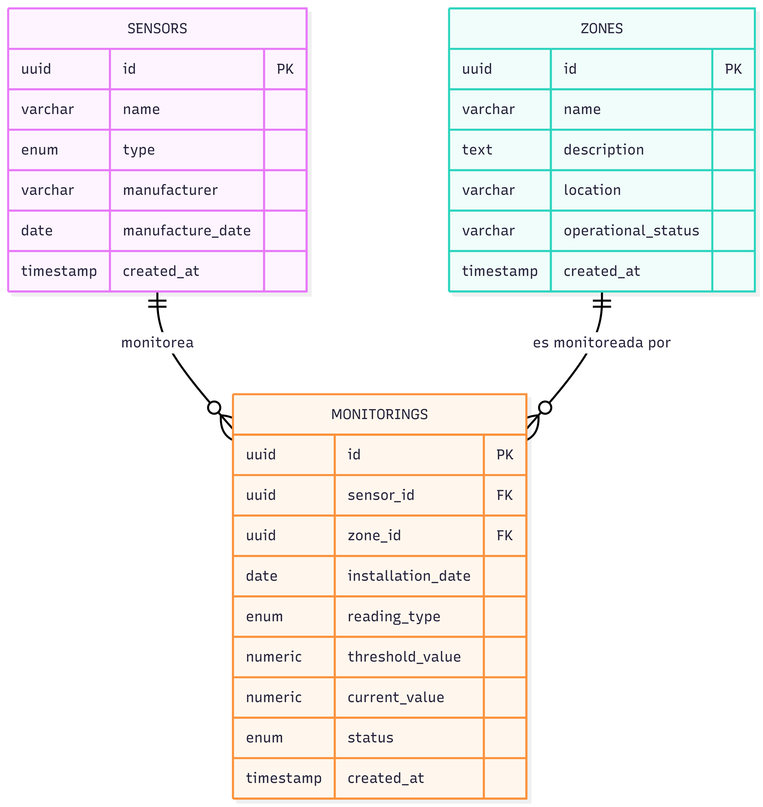

# DECISIONS.md 

---

## 0. Decisiones adoptadas para la solucion.

La decision mas importante esta relacionada con como se iba construir la app, si solo iba a ser una app con listados y ya o algo mas "intuitivo". Al final se decisio hacer una especie de "Gemelo Digital" que conbina la utilidad de poder visualizar los sensores en vivo junto a metricas de estos mismos, ademas de una funcion de "ubicacion" que permite situarlos mas facilmente dentro de la "fabrica". Esto cumple directamente con el objetivo general del proyecto el cual es **Una planta industrial necesita un sistema para rastrear qué sensores están asignados a qué zonas de la planta**.

Se decidio usar un **modelo SQL** para la base de datos para mantener la **integridad referencial** entre los sensores y sus mediciones. **NoSQL no aporta nada** con su diseño de documentos, solo añadiria complejidad innecesaria.

Se decidio usar **Drizzle ORM** ya que es el que mejor se integra con **TypeScript** sin necesidad de herramientas externas o codigo extra. 

Se decidio usar **NodeJS + Fastify** debido a la cercania que ya se posee con estas tecnologias, ademas de que tienen una velocidad superior a **ExpressJS** y tambien integracion nativa con TypeScript y schemas de validacion.

Se decidio usar **React** para el frontend sin ningun framework adicional para mantener baja la complejidad de la aplicacion pero haciendo uso de las bondades de esta tecnologia como seria el uso de Hooks y States dinamicos para los requisitos de una SPQ reactiva.

Como **adicional** se añadio una capa de **historico** de mediciones. Para tal motivo se creo una nueva entidad y tambien se dejo una **desnomalizacion consciente** de `current_value` en monitoring ya que permite consultar el estado de todos los sensores sin llamdas externas a `readings`.

Se utilizo un Docker multi-stage para facilitar el montaje de toda la aplicacion y garantizar que funcione sin importar donde se trate de montar.

---

## 1. ¿Cómo modelaste la relación entre sensores y zonas y por qué?

La modelé como una relacion de **muchos a muchos** con **atributos propios**. Adicionalmente agregue una entidad para generar un historico de "mediciones" llamado "Readings".
Monitorings se usa como la "posicion" y muestra el valor "actual". Mientras que Readings guardar el historico de las lecturas.

- Un sensor puede monitorear multiples zonas al mismo tiempo
- Una zona puede tener multiples sensores al tiempo
- Esto existe una relacion **N:N** obligatoria.
- La asignacion adicionalmente contiene **informacion propia** que no se puede realizar con una tabla join.
- Se agrega una clave unica `(sensor_id, zone_id)` para evitar que un sensor se pueda asignar dos veces a la misma zona.
- El valor de la lectura se pone en la tabla `monitorings` ya que esta lectura puede ser diferente segun la zona.



## 2. ¿Qué validación o restricción consideras más importante y por qué?
 
El **`UNIQUE INDEX` en `(sensor_id, zone_id)`** de la tabla `monitorings`.

- Esta restriccion se aplica a nivel de BASE de DATOS y a nivel de SERVICIO.
- Sin esta restriccion se podrian un sensor podria estar en la misma zona varias veces.
- A nivel de servicio se traduce como un `ConflictError`(409).
- Afecta a la integridad y calidad de las mediciones del sistema.

## 3. ¿Cómo organizaste la estructura del backend y por qué elegiste esa organización?

Se eligio una version simplificada de la **Arquitectura Limpia**. En este caso solo usamos 3 capas para asegurar el 
principio de separacion de responsabilidades (Rutas, Servicios, Repositorios).

```
Route → Service → Repository → Drizzle → PostgreSQL
```

- **Route** solo recibe las **Request**, llama al **servicio** y retorna la respuesta HTTP
- **Services** contiene toda la logica de negocio y las validaciones de dominio. No conoce nada de HTTP, lo que permite probarlos y reusarlos sin fastify.
- **Repositories** son basicamente queries de Drizzle para comunicacion con la DB.

- Cada capa solo tiene **una razon para cambiar**. Si cambia la **DB** solo toco **Repositories**. Si cambia una **Regla de Negocio** solo toco **Services**.
- Es una arquitectura estandar que facilita el mantinimiento y la evaluacion de otros desarrolladores.

## 4. Si tuvieras un día adicional, ¿qué implementarías primero y por qué?

**Modo edición del plano de planta**. Es decir, permitir al usuario construir manualmente las zonas de la "fabrica" en una interfaz de construccion con grilla (grid).
Esto resultaria en un Gemelo Digital completamente personalizable y facilmente usable en cualquier fabrica, empresa, etc. que requiera monitorizacion de sus sensores.
Tambien considero que con el limite de tiempo de **1 dia adicional** esta nueva funcionalidad encaja perfecto.

- Como la aplicacion fue pensada como un **gemelo digital** tener un modo edicion es un paso normal en su linea evolutiva.
- Requiere persistir la ubicacion (x/y) de la zona y los **monitorings** en base de datos.
- En el frontend simplemente seria un extra sobre lo que ya se tiene (en la grid) junto a un par de endpoints para la administración de zonas.
